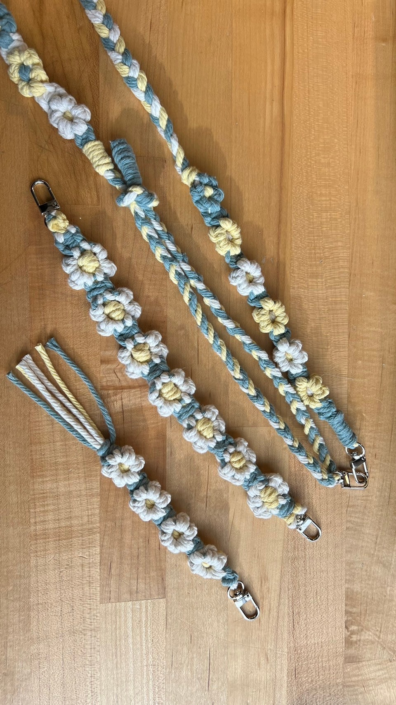
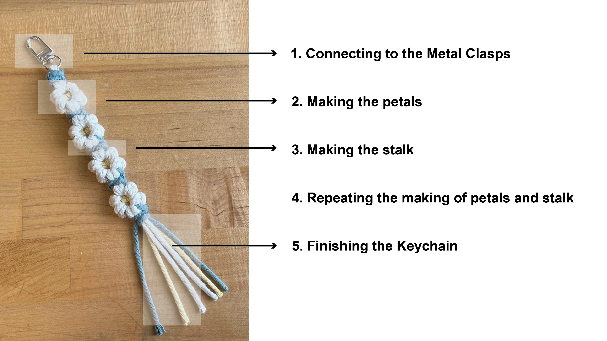
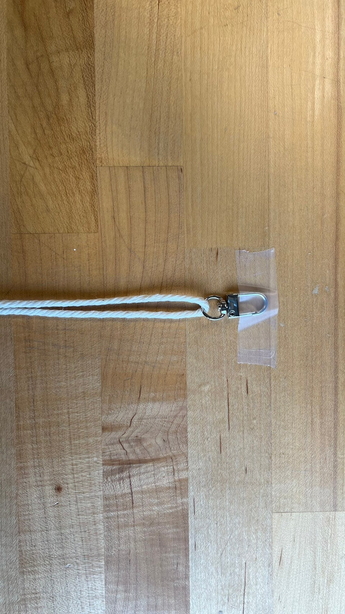
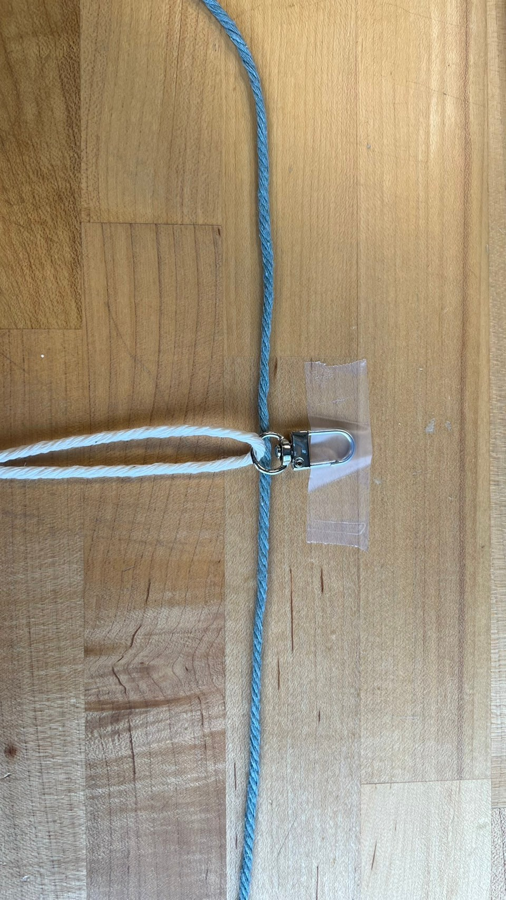
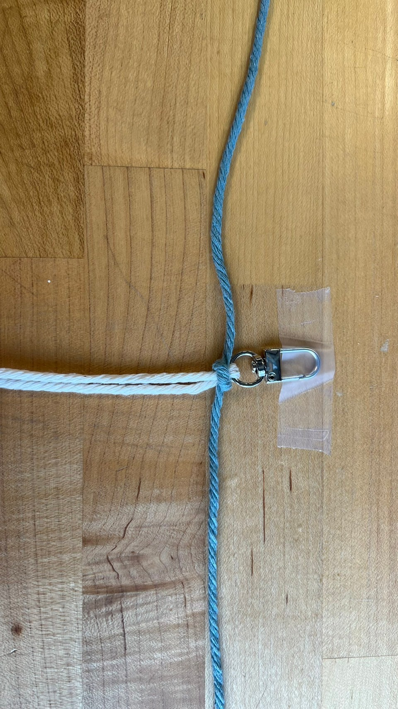

# Hi! 👋 Welcome to Macrame Flower Keychain Workshop

---
### Here are the materials you'll need to prepare:
- 1 pc of **150cm** stalk (BLUE) 🔵
- 1 pc of **180cm** petals (WHITE) ⚪
- 1 pc of **100cm** center (YELLOW) 🟡

---

### The making of the Macrame Flower Keychain can be divided into the following five steps:

---

### Step 1: Connecting to the Metal Clasps
- Thread the 180cm ⚪ cotton rope through the Metal Clasps.

- 2 full square knots.

