# Hi! 👋 Welcome to Macrame Flower Keychain Workshop

---
### Here are the materials you'll need to prepare:
- 1 pc of **180cm** petals (WHITE) ⚪
- 1 pc of **150cm** stalk (BLUE) 🔵
- 1 pc of **100cm** center (YELLOW) 🟡

---

### Macrame Flower Keychain can be divided into five steps:

---

### 1: Connecting to the Metal Clasps -  [YouTube tutorial video (0:18-0:52)](https://www.youtube.com/watch?v=AGhiYfnpfYA)

- Thread the ⚪ rope through the Metal Clasps.

- Take the 🔵 rope and make 2 full square knots.

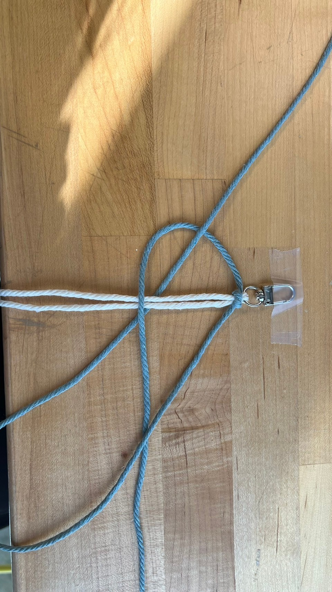
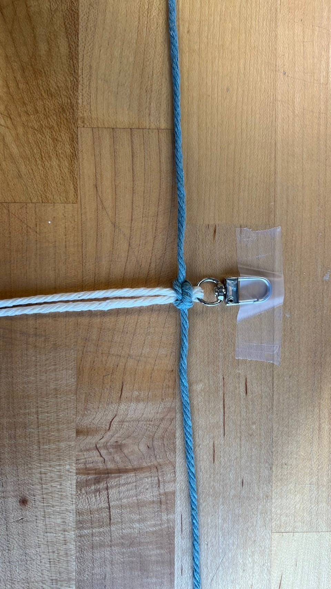
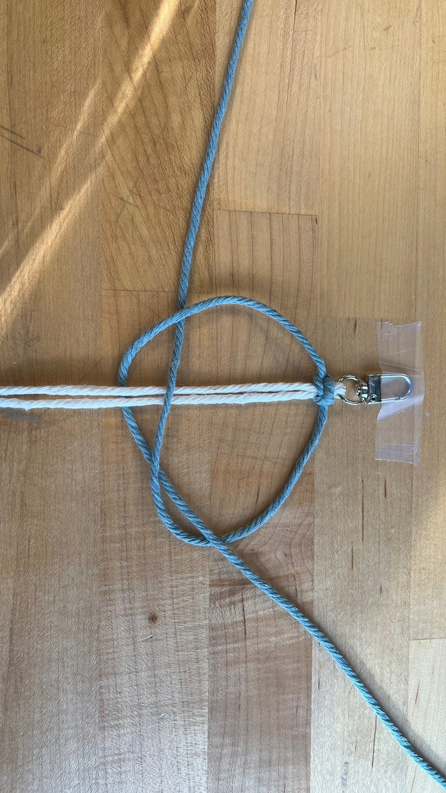
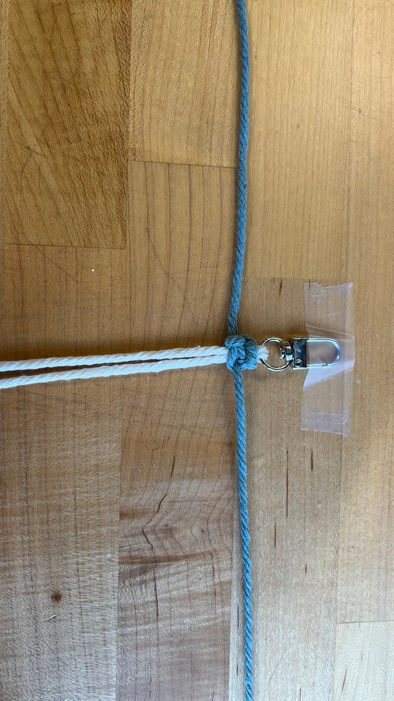
---

### 2: Making the petals - [YouTube tutorial video (0:54-0:)](https://www.youtube.com/watch?v=AGhiYfnpfYA)
#### 2-1: Making the top layer of petals.

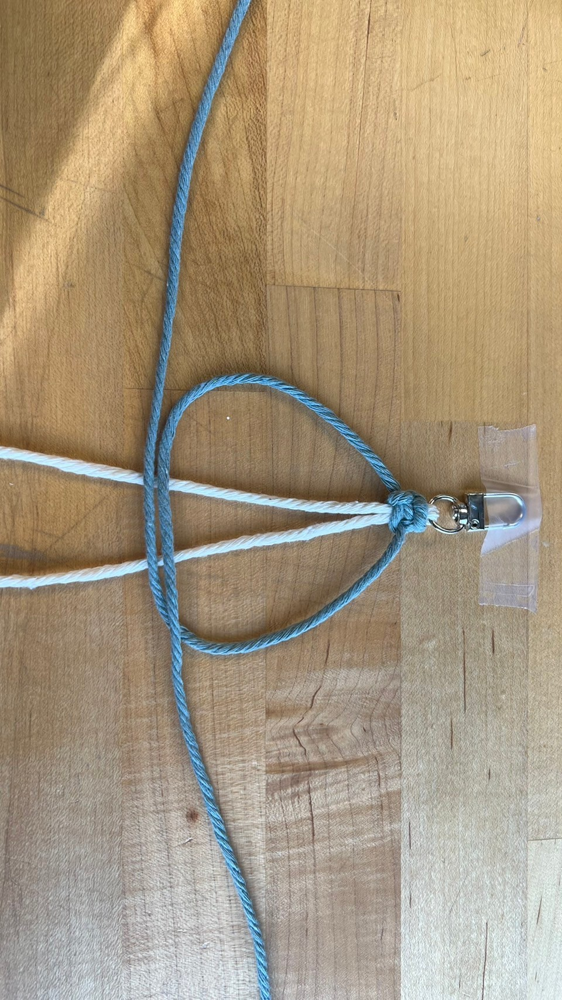
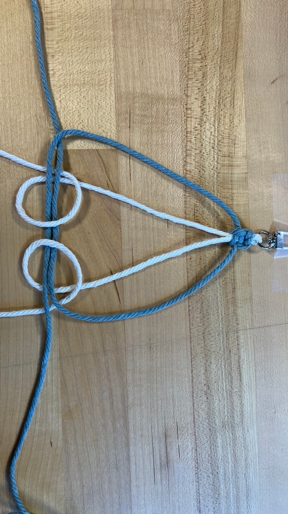

- Take the 🟡 rope and thread it through the hole formed by the ⚪ rope, then pull tight.

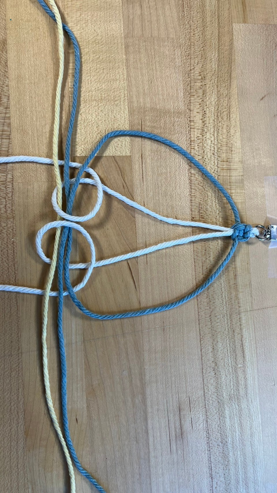
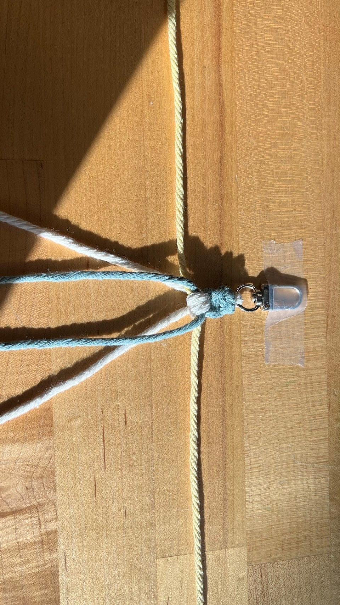

#### 2-2: Making the top left petal.
- The ⚪ rope presses down on the 🔵 rope, then emerges from underneath the 🔵 rope, then pull tight.

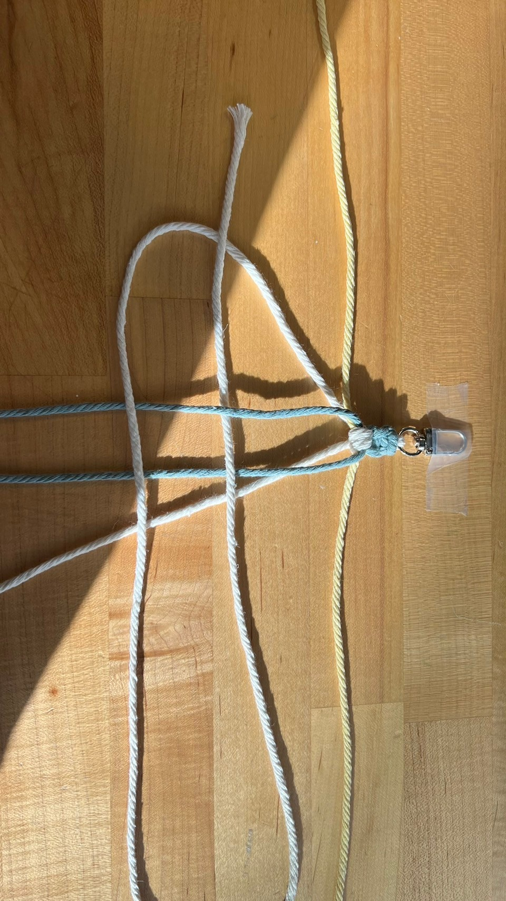

- Conversely, the ⚪ rope comes out from under the 🔵 rope, then presses on top of the 🔵 rope, then pull tight.

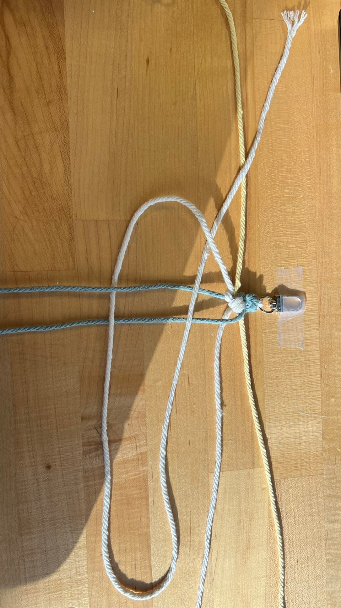

- The top left petal has been completed!

#### 2-3: Making the top right petal.
- The method of making it is the same as before!
- The ⚪ rope presses down on the 🔵 rope, then emerges from underneath the 🔵 rope, then pull tight.

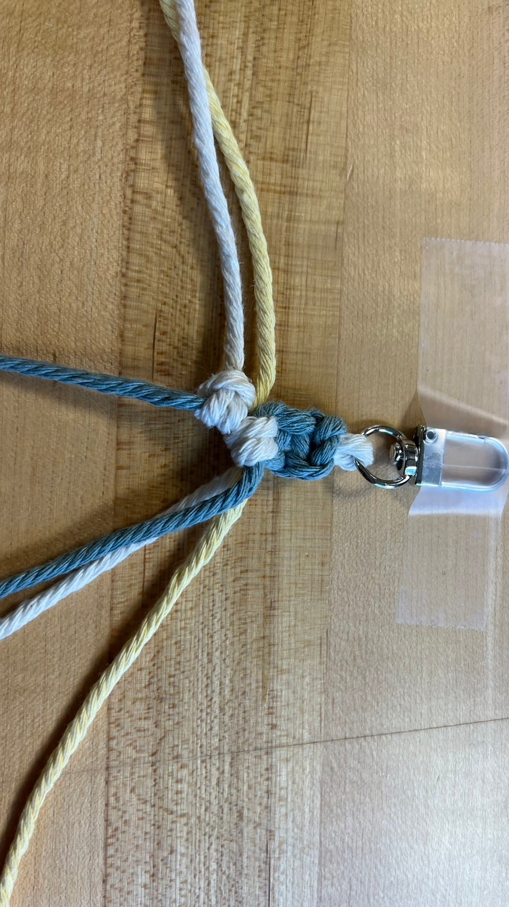

- Conversely, the ⚪ rope comes out from under the 🔵 rope, then presses on top of the 🔵 rope, then pull tight.

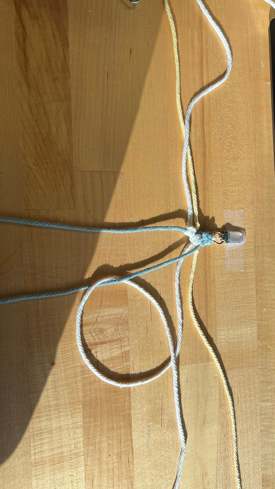

- The top right petal will then also be completed!

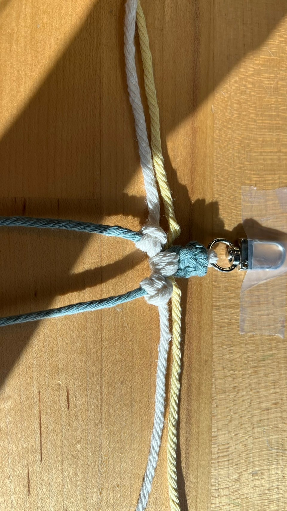

#### 2-4: Making the center.
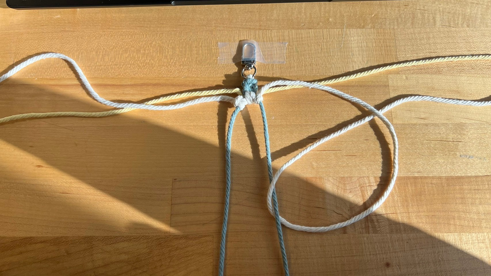

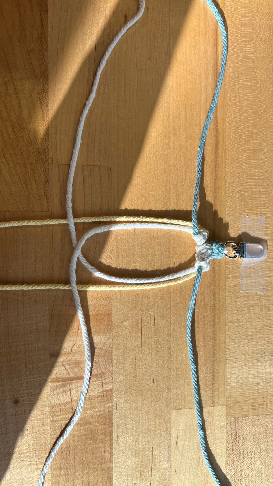
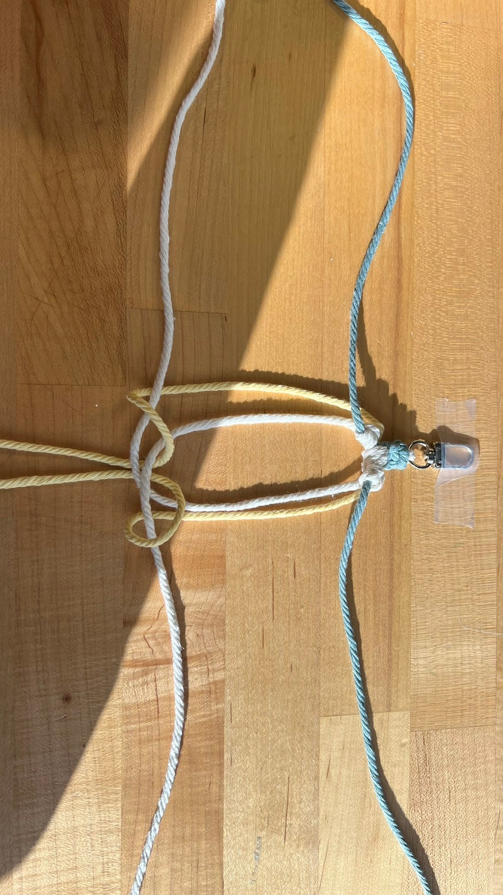

#### 2-5: Making the bottom left petal.

#### 2-6: Making the bottom right petal.

#### 2-7: Making the bottom.