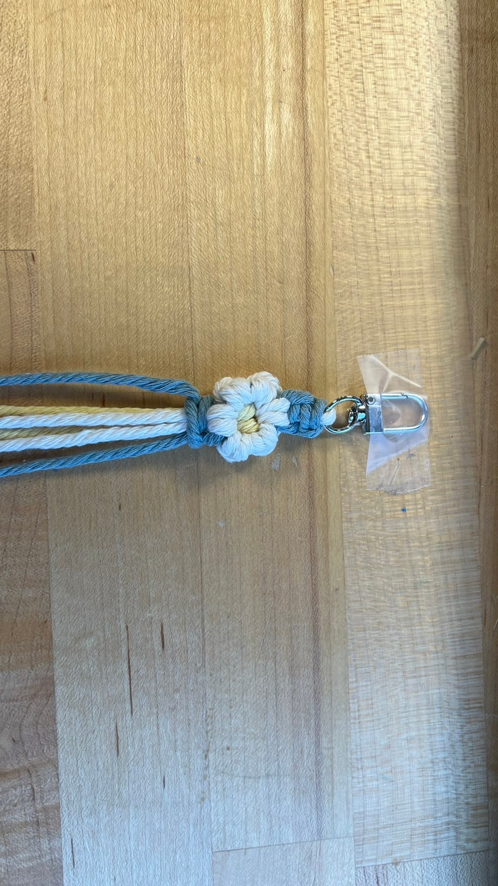

# Hi! 👋 Welcome to Macrame Flower Keychain Workshop

---
### Here are the materials you'll need to prepare:
- Colors can be changed according to your own preference; below, the colors ⚪🔵🟡 are used as an example.

- 1 pc of **180cm** petals (WHITE) ⚪
- 1 pc of **150cm** stalk (BLUE) 🔵
- 1 pc of **100cm** center (YELLOW) 🟡

---

### Macrame Flower Keychain can be divided into five steps:
- [1. Connecting to the Metal Clasps](https://github.com/liliana0514/workshop/tree/main?tab=readme-ov-file#1-connecting-to-the-metal-clasps----youtube-tutorial-video-018-052)
- [2. Making the petals](https://github.com/liliana0514/workshop/tree/main?tab=readme-ov-file#2-making-the-petals---youtube-tutorial-video-054-325)
- [3. Making the stalk](https://github.com/liliana0514/workshop/tree/main?tab=readme-ov-file#3-making-the-stalk---youtube-tutorial-video-333-403)
- [4. Repeating the making of petals and stalk](https://github.com/liliana0514/workshop/tree/main?tab=readme-ov-file#4-repeating-the-making-of-petals-and-stalk)
- [5. Finishing the Keychain](https://github.com/liliana0514/workshop/tree/main?tab=readme-ov-file#5-finishing-the-keychain)

---

### 1: Connecting to the Metal Clasps
- [YouTube tutorial video (0:15-0:52)](https://youtu.be/AGhiYfnpfYA?t=15)

- Thread the ⚪ rope through the Metal Clasps.

- Take the 🔵 rope and make 2 full square knots.

---

### 2: Making the petals
- [YouTube tutorial video (0:50-3:25)](https://youtu.be/AGhiYfnpfYA?t=50)
#### 2-1: Making the top layer of petals.

- Take the 🟡 rope and thread it through the hole formed by the ⚪ rope, then pull tight.

- The top petal has been completed!
#### 2-2: Making the top left petal.

- The top left petal has been completed!

#### 2-3: Making the top right petal.
- The method of making it is the same as before!

- The top right petal has been completed!

#### 2-4: Making the center.

- The center has been completed!

#### 2-5: Making the bottom left petal.

- The bottom left petal has been completed!

#### 2-6: Making the bottom right petal.

- The bottom right petal has been completed!

#### 2-7: Making the bottom.

- The bottom petal has been completed!

### 3: Making the stalk 
- [YouTube tutorial video (3:30-4:03)](https://youtu.be/AGhiYfnpfYA?t=210)

- You can make a varying number of stalks based on your own preference; this example involves making two stalks.
- First stalk.

- Second stalk.

- The stalk has been completed!

### 4: Repeating the making of petals and stalk

- Repeat steps 2 and 3 until you reach the desired length.

- For detailed instructions, please refer to [step 2](https://github.com/liliana0514/workshop/tree/main?tab=readme-ov-file#2-making-the-petals---youtube-tutorial-video-054-325) and [step 3](https://github.com/liliana0514/workshop/tree/main?tab=readme-ov-file#3-making-the-stalk---youtube-tutorial-video-333-403).

### 5: Finishing the Keychain 

- [YouTube tutorial video (5:15-5:31)](https://youtu.be/AGhiYfnpfYA?t=315)

- Repeat steps 2 and 3 until you reach the desired length, then trim the cotton rope to the ideal length.

- Congratulations on completing your Macrame Flower Keychain!🌸